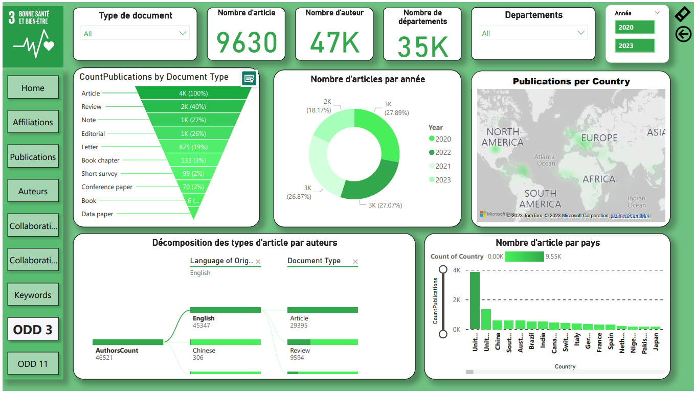
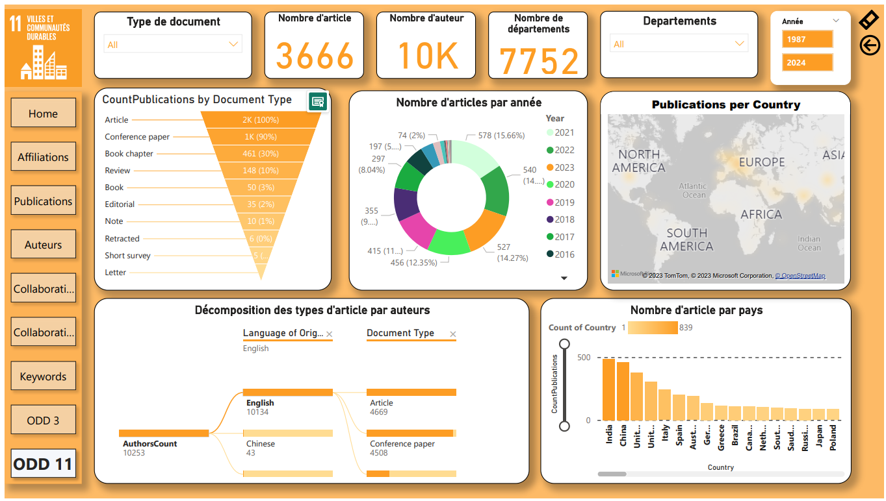

# Analysis-Project-Global-Health-and-Sustainable-Cities-Insights

## Project Overview
This project is dedicated to analyzing and visualizing global data related to **ODD 3 (Good Health and Well-being)** and **ODD 11 (Sustainable Cities and Communities)**. Using open-source data from **Scopus**, I conducted comprehensive data analysis and visualizations in **Power BI** to provide meaningful insights into the current world situation in these areas.

## Objectives
- **ODD 3 (Good Health and Well-being)**: Evaluate global health indicators, such as access to healthcare, disease prevalence, and health outcomes.
- **ODD 11 (Sustainable Cities and Communities)**: Assess sustainability metrics in urban areas, including air quality, housing conditions, and transportation systems.

## Data Collection
- **Source**: Open-source data retrieved from **Scopus**.
- **Methodology**: Data collection was carried out by extracting research publications and reports relevant to ODD 3 and ODD 11.

## Tools and Technologies Used
- **Data Analysis**: Python (for preprocessing and analysis)
- **Visualization**: Power BI (for interactive dashboards)
- **Data Source**: Scopus database

## Process Workflow
1. **Data Extraction**: Extracted open-source data from Scopus related to ODD 3 and ODD 11.
2. **Data Cleaning and Preprocessing**: Utilized Python libraries for data transformation.
3. **Data Visualization**: Created interactive dashboards in Power BI to display key metrics and trends.
4. **Analysis and Insights**: Generated visual reports to highlight significant patterns and draw conclusions about the global situation regarding health and sustainable cities.

## Key Visualizations

### Health Indicators Dashboard

### Urban Sustainability Dashboard

## Insights and Conclusions
- **ODD 3**: The analysis reveals current trends in health metrics, identifying regions that have made significant progress and those facing challenges.
- **ODD 11**: The data highlights areas where urban sustainability initiatives are successful and where further development is needed.

## Future Work
- **Expand Data Sources**: Incorporate additional datasets from other global databases.
- **Machine Learning**: Implement predictive models to forecast future trends in health and urban sustainability.
- **Interactive Features**: Enhance Power BI dashboards with more interactive features for better user engagement.

## How to Run the Project
1. **Clone the Repository**: `git clone <repository-url>`

2. **Load Power BI Dashboards**:
   - Open Power BI and import the `.pbix` file to view the visualizations.

## Acknowledgments
- **Data Source**: Scopus
- **Visualization Tools**: Power BI
- **Inspiration**: UN's Sustainable Development Goals (SDGs)
